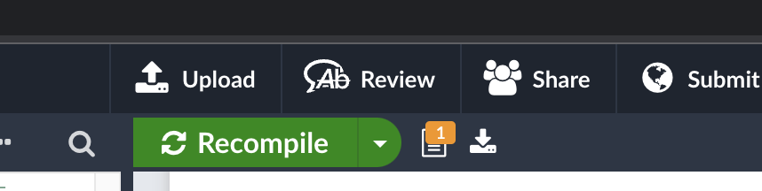
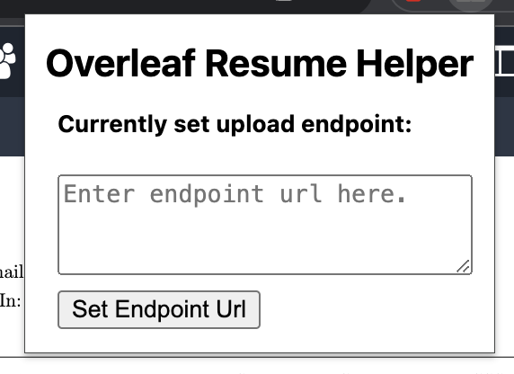

### Overleaf Resume Helper

This chrome extension is just a helper to upload the pdfs directly onto an endpoint without the need to manually download then upload. For example for myself, it makes updating my resume on my homepage much easier, my resume is stored in an S3, and this helper can upload to the S3 directly.

### How to use

If you want to try it out, simply clone this repo, then load the extension into chrome.
You will see an upload button appear on the toolbar as shown below:

To set the endpoint to upload to, simply input the endpoint url into the textarea:

